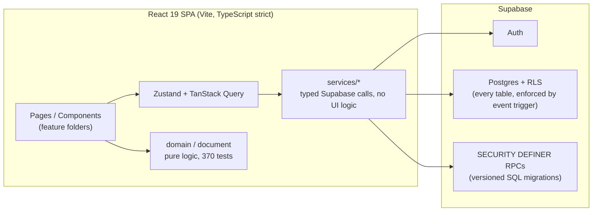

<p align="center">
  
</p>

<p align="center">
  
  
  
  
  
</p>

**MOXIE is a coaching platform for performance athletes.** It replaces the per-athlete Excel sheets that coaches actually use today: the coach builds and adapts training programs week by week in a spreadsheet-style builder, athletes log their sessions set-by-set from a mobile portal, and the system keeps both sides in sync — load monitoring, readiness, and structured feedback included.

Built by a coach-developer for real daily use: MOXIE currently runs in production for a small group of coaches and their athletes. It is not a generic fitness app — every design decision comes from the operating context of real coaching, originally documented from a track & field throws practice in [`docs/Overview`](docs/Overview) and generalized from there.

> 🇮🇹 The product UI is in Italian, because its users are Italian coaches. Domain entities in the codebase (`programmi`, `settimane`, `prescrizione`…) follow the same convention, consistently.

---

## What it does

### Coach side

| Module | What you can do |
|---|---|
| **Dashboard / Roster** | Daily entry point: active athletes with readiness traffic-lights, unread feedback count, automatic *"skipped last week"* alerts, 7-day/month/3-month athlete overview |
| **Athletes** | Full athlete record: overview with estimated 1RM, athlete state (derived from logs + wellness), planned-vs-done metrics, training logs. Invite-token onboarding (expiring, regenerable), offboarding via archiving (soft delete, no broken FKs, history kept for the Analyser), and a coach-triggered "erase sensitive data" action for right-to-erasure requests |
| **Program Center** | Programs, templates and drafts with lifecycle states (draft → active → completed/archived), DB-enforced "one active program per athlete" with conflict resolution, deep server-side cloning, save-as-template, 4-step creation wizard, bulk-assign a template to multiple athletes at once |
| **Program Builder v3** | The core: an Excel-style grid editor over the Blocks → Cycles → Weeks → Sessions → Exercises hierarchy. Rich prescription grammar (reps/time/distance/throws; load as kg, %1RM or RPE; top set, wave loading, pyramid, AMRAP, EMOM), row groupings (supersets/circuits with A1/A2 codes), detached weeks with explicit dates, calendar planning view, weekly volume & tonnage, "time machine" versioning (named snapshots with a green/red diff view against the current document, restore or delete), audit trail of last edit, and shared write access for coaches with explicit write permission on an athlete |
| **Command Center** | Neural-demand view across the roster: System Map, Quick Review Roster and the Finger Tap Test neuromotor metric, driven by per-exercise `cns_complexity` and coach-set `target_cns`/global RPE target overrides |
| **Analyser** | Per-athlete analytics (fatigue/ACWR, average intensity %1RM, history, weekly diary) and per-program analysis with program-vs-program comparison. Graceful degradation: no more silent invented fallbacks — an explicit hierarchy of real data → coach override → engine estimate → `null`, with an "estimated" badge in the UI |
| **Calendar** | Events and competitions, linked to athletes and programs |
| **Exercise Library** | Shared library with tags, filters, per-exercise tracking type, and variant families (squat and front squat align on the same matrix row) |
| **Feedback Center** | Aggregated athlete feedback queue with time filters, CNS-fatigue/RPE classification, read state, coach notes |
| **Notifications** | Coach-side panel with a weekly digest and per-channel settings, mirroring the athlete-side center below |

### Athlete side (mobile portal)

| Screen | What you can do |
|---|---|
| **Week** | Navigate weeks, day strip, session cards — always consistent with the coach's builder thanks to a shared, gap-aware program calendar |
| **Session** | Set-by-set logging with +/− steppers, readable prescriptions, grouped exercises, session close with RPE + notes to the coach, and injury reporting straight to the coach |
| **Progress** | Load & readiness, strength PRs (estimated 1RM) |
| **Wellness** | Multi-dimension wellness check-in (MWB), trend chart, history |
| **Notifications** | Installable PWA notification center with push notifications for coach feedback, upcoming sessions and program changes |

### The domain engine

The part you don't see, and the reason this isn't just CRUD over a database:

- **ACWR fatigue index** — acute:chronic workload ratio, *uncoupled* model (the acute week is excluded from the chronic average, otherwise the ratio collapses toward 1), 0.8–1.3 sweet spot
- **Estimated 1RM** — Epley formula, deliberately restricted to the 1–6 rep range where it is accurate
- **Readiness score (0–100)** — wellness-driven when available, with an explicit heuristic fallback
- **Skipped-week detection** — flags athletes whose planned week produced no logs, so the coach recalibrates deliberately
- **Planned-vs-done reporting** — prescribed sets/reps/tonnage against actual logs, per week and per exercise
- **Shared program calendar** — a single date-math source used by both the builder and the athlete portal, so the two views can never disagree

All of it is pure, framework-free TypeScript, covered by **370 unit tests**.

---

## Architecture

A frontend-only SPA with **no custom backend**: Supabase (Postgres + Auth + Row Level Security) is the entire server. Privileged, transactional logic lives in versioned `SECURITY DEFINER` Postgres functions.



The most interesting piece is the **Program Builder's document model** ([`src/features/programs/document/`](src/features/programs/document)): instead of CRUD-ing a remote tree node by node, the whole program is loaded once into a normalized in-memory document, edited immutably with structural sharing, and saved through a computed **diff** in a single transactional RPC. This is what makes an Excel-grade editing experience possible on top of a relational schema.

---

## Security

Multi-tenant by construction — coaches only see their own athletes, athletes only see themselves — enforced at the database level, not in UI code:

- **RLS on every table**, plus an [event trigger](supabase/migrations/00000000000001_event_trigger_ensure_rls.sql) that prevents any future table from being created without RLS
- A **dedicated security audit** (July 2026) found and closed real authorization gaps — including a critical cross-tenant policy — documented transparently in [`20260708120000_security_hardening.sql`](supabase/migrations/20260708120000_security_hardening.sql) with severity ratings
- Every fixed vulnerability has an **integration test that reproduces the attack** in [`tests/rls/security.test.ts`](tests/rls/security.test.ts): two independent tenants attempt the exact cross-tenant scenario and the test asserts it is blocked
- Athlete onboarding uses **expiring, regenerable invite tokens** instead of permanent identifiers ([`20260708130000_athlete_invite_token.sql`](supabase/migrations/20260708130000_athlete_invite_token.sql)), with the residual trade-off documented in the migration itself
- **Leaked-password check at signup**: the registration password is checked against the Have I Been Pwned range API in k-anonymity mode (only a 5-char SHA-1 prefix leaves the browser, never the password itself); a zero-cost stand-in for the native protection Supabase only offers from the Pro plan up
- **Routing wall**: coach/athlete route guards decide the redirect before any coach-only header can mount, covered end-to-end so no coach UI ever flashes for an athlete session
- **Right to erasure (Art. 9)**: a dedicated, ownership-checked `SECURITY DEFINER` RPC lets a coach redact an athlete's sensitive wellness/health fields on request, deliberately kept independent from (reversible) archiving
- **Anti-sharing watermark** on the Athlete Portal: a tiled overlay with the athlete's email + timestamp, plus a block on copy/context-menu/text-selection across `/app/*`, to discourage bulk copying of program content
- No secrets in the client bundle: the service-role key is used only by local test tooling and never carries the `VITE_` prefix

---

## Testing

Three layers, each with a distinct job:

| Layer | What it covers | Where it runs |
|---|---|---|
| **Unit** (`npm run test`) — 370 tests | Pure domain logic: prescriptions, aggregates, diffing, ACWR, 1RM, program calendar, program-status regression guards | Every PR in CI |
| **RLS integration** (`npm run test:rls`) | Attack-reproducing authorization tests against a real Supabase project | Locally, before merging anything touching RLS/RPC |
| **E2E** (`npm run test:e2e`) — Playwright | Critical flows: athlete session logging, auth & routing, program wizard, dialog accessibility, error boundaries, skipped-week alert | Locally, before merging critical-flow changes |

Plus: TypeScript `strict`, ESLint with 0 errors, error boundaries per app area, and a vendor-neutral error-reporting hook ([`src/lib/observability.ts`](src/lib/observability.ts)).

---

## How it was built

MOXIE was designed, developed and operated by a single developer with direct domain expertise in athletic coaching, over ~3 months of iterative work — **AI-assisted, human-directed**. Claude Code was used as a development accelerator (and appears transparently as co-author in the commit history); every architectural decision, security trade-off and scope call is human-owned and documented where it was made: migrations explain *why* and what risk was accepted, code comments record constraints rather than paraphrasing code, and the PR history shows the full audit → harden → test cycle.

Process, in practice:

1. **Product context first** — the coach's real workflow was documented ([`docs/Overview`](docs/Overview)) before the modules were built
2. **PR-based workflow** with CI (lint → typecheck → test → build) on every PR to `main`
3. **A full technical due-diligence pass** (July 2026) drove the production-hardening phases: security audit, tooling, test layers, observability, accessibility
4. **Deliberate debt** — known trade-offs are recorded as accepted decisions, not swept under the rug

---

## Getting started

```bash
npm install
cp .env.local.example .env.local   # fill in your Supabase project URL and anon key
npm run dev                        # dev server on port 3000
```

Requires **Node 22+** (`@supabase/realtime-js` needs the native WebSocket global).

### Scripts

| Command | What it does |
|---|---|
| `npm run dev` | Dev server (port 3000) |
| `npm run build` | Typecheck + production build |
| `npm run lint` | ESLint |
| `npm run format` | Prettier (write) |
| `npm run test` | Unit tests (pure logic, `vitest`) — the suite that runs in CI |
| `npm run test:rls` | RLS integration tests against a **remote** Supabase project — requires `SUPABASE_SERVICE_ROLE_KEY` in `.env.local`, does not run in CI |
| `npm run test:e2e` | Playwright E2E on critical flows — same requirement as `test:rls` |

### Testing against a remote Supabase project

`test:rls` and `test:e2e` create and delete real users (tagged `*-moxie-rls-test.invalid` / `*-moxie-e2e-test.invalid`) on the Supabase project pointed to by `.env.local`. They need both `VITE_SUPABASE_URL`/`VITE_SUPABASE_ANON_KEY` and `SUPABASE_SERVICE_ROLE_KEY` (Supabase Dashboard → Project Settings → API → `service_role`, **never** committed, **never** prefixed with `VITE_` so it can't end up in the client bundle). See [`tests/rls/setup.ts`](tests/rls/setup.ts) and [`e2e/helpers/seed.ts`](e2e/helpers/seed.ts).

### CI

GitHub Actions runs lint → typecheck → `npm run test` → build on every PR to `main`. `test:rls`/`test:e2e` don't run in CI (they need real network + secrets) — run them locally before opening a PR that touches RLS, RPCs or critical flows.

---

## Status & direction

In production use at small scale (a handful of coaches, ~a dozen athletes) — deliberately. The near-term direction is operational solidity over feature count: active error monitoring, verified backups, and concurrency guarantees on the builder. **Notifications** (push + weekly digest, both sides) shipped in August 2026; GDPR/legal infrastructure (`docs/compliance/`) is being built out incrementally alongside it. On the product side, the most distinctive planned feature is full **load recalibration** — today the system detects the gap between planned and done; tomorrow it proposes the program shift — plus an **offline-capable athlete portal** for gyms and throwing circles without signal.

## License

Personal project — all rights reserved. Get in touch if you want to use it or build on it.
